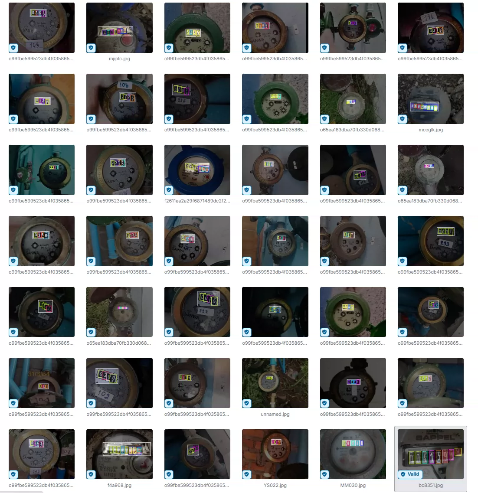
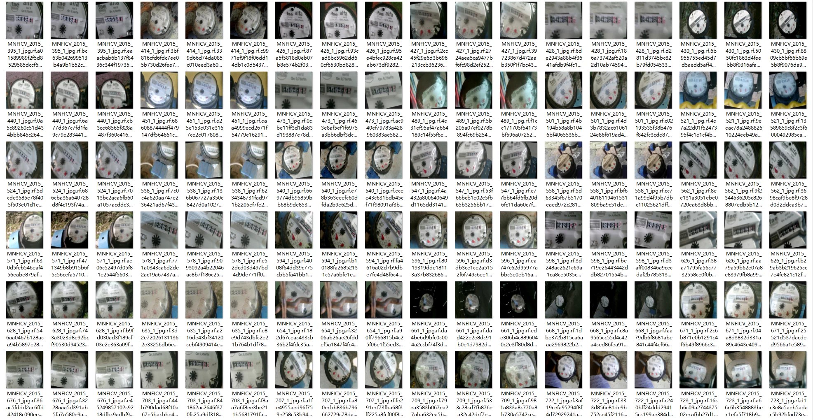
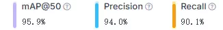
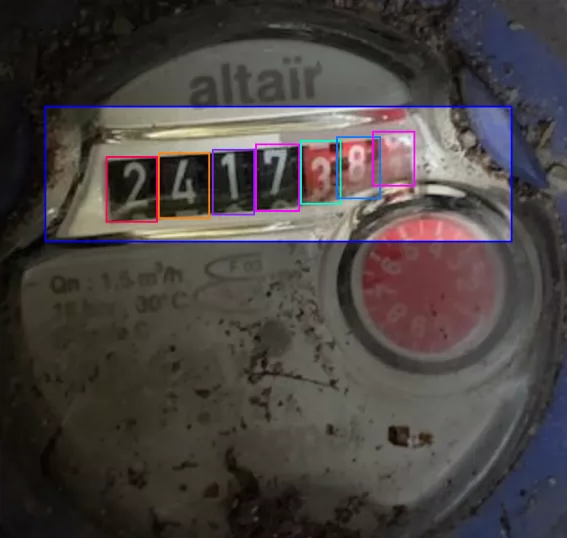
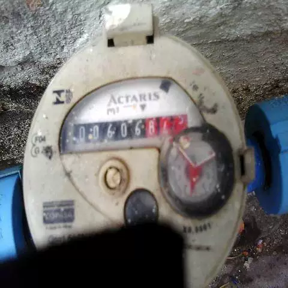
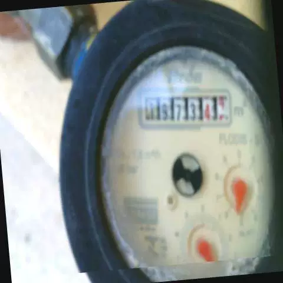
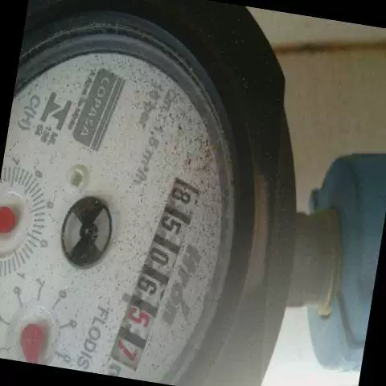

## Body

Water Meter Number Recognition Dataset in YOLO format

Totally 17,676 images, each labeled with YOLO format. The training set (16,302), test set (681), and validation set (693) are well-defined.

The dataset is divided into 10 categories, namely '0', '1', '2', '3', '4', '5', '6', '7', '8', '9'.

Electronic virtual products sold are not returnable.

## Images

Here is a pay link on Stripe ( https://buy.stripe.com/3cs8yP7sY87d0vu9AB ). Please contact me lonlonago@foxmail.com after funding $89, and I will send you a complete data files , thank you!

